<a href="https://nexeraofficial.in">
  <picture>
    <source media="(prefers-color-scheme: dark)" srcset="./assets/banner-dark.svg">
    <source media="(prefers-color-scheme: light)" srcset="./assets/banner-light.svg">
    
  </picture>
</a>

  <a href="https://nexeraofficial.in"><b>nexeraofficial.in</b></a>
  &nbsp;&middot;&nbsp;
  <a href="https://github.com/alokkkchaudharyyy?tab=repositories">Projects</a>
  &nbsp;&middot;&nbsp;
  <a href="https://www.linkedin.com/in/alokkchaudharyy">LinkedIn</a>
  <!-- &nbsp;&middot;&nbsp; <a href="https://x.com/YOUR-HANDLE">X</a> -->
  <!-- &nbsp;&middot;&nbsp; <a href="mailto:YOUR-EMAIL">Email</a> -->

 

### About

I write code and I run a company. As the founder and CEO of [**NEXERA**](https://nexeraofficial.in), I lead the team building a student-driven ecosystem for education, events and community, and I still ship a good share of the code myself.

- **Building:** NEXERA, end to end. A Next.js frontend, an Express and Prisma API on PostgreSQL and Redis, real-time features over Socket.IO, and a self-hosted code judge.
- **Focus:** product engineering, systems that scale, and taking ideas from a whiteboard to production fast.
- **Practicing:** data structures and algorithms in C++.
- **Ask me about:** startups, edtech, Next.js and system design.

 

### Now building

<a href="https://nexeraofficial.in">
  <picture>
    <source media="(prefers-color-scheme: dark)" srcset="./assets/nexera-dark.svg">
    <source media="(prefers-color-scheme: light)" srcset="./assets/nexera-light.svg">
    
  </picture>
</a>

 

### Toolkit

<picture>
  <source media="(prefers-color-scheme: dark)" srcset="./assets/stack-dark.svg">
  <source media="(prefers-color-scheme: light)" srcset="./assets/stack-light.svg">
  
</picture>

 

### Activity

<picture>
  <source media="(prefers-color-scheme: dark)" srcset="./metrics/calendar-dark.svg">
  <source media="(prefers-color-scheme: light)" srcset="./metrics/calendar-light.svg">
  
</picture>

 

  The calendar redraws itself every night with GitHub Actions. Thanks for stopping by.

